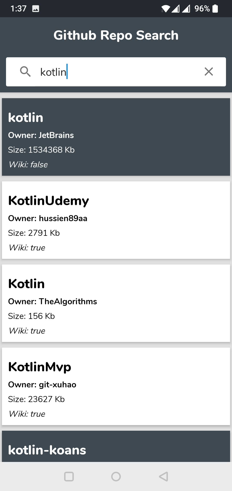

# Github-Repo-Search
Android Application to demonstrate the implementation of Github search API

## Table of Contents

- [App](#app)
- [TechStack](#techstack)
- [Screenshots](#screenshots)
- [Api](#api)
- [Architecture](#architecture)
- [Libraries](#libraries)

## App
GitHub Repo Search allows you to search for different repositories.
Features:
Search for GitHub repositories and returns a list of 10 matching repositories.
Scroll to the bottom to fetch another 10 repositories and so on.

## TechStack
The project uses Kotlin language. For network requests, it uses Retrofit with RxJava.
Dagger2 has been used for Dependency injection.

## Screenshots

## Api
App uses [Github Search API](https://docs.github.com/en/rest/search) to fetch repositories.

## Architecture
The project is built using MVVM pattern. MVVM allows for the separation of concern which also makes testing easier.

## Libraries
Libraries used in the whole application are:

- [RxJava](https://github.com/ReactiveX/RxJava) - RxJava is a Java VM implementation of Reactive Extensions: a library for composing asynchronous and event-based programs by using observable sequences.
- [Dagger2](https://dagger.dev/dev-guide/) - Used for Dependency injection
- [Retrofit](https://square.github.io/retrofit/) - Turns your HTTP API into a Java interface.

